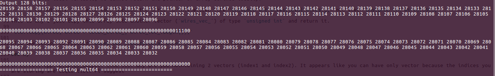
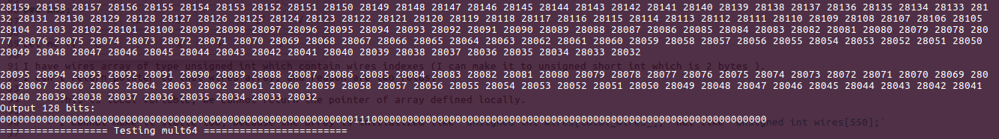

# Digitaldesign

### Build code

```
cd digitaldesign
mkdir build
cd build
cmake ..
make
```

### Online Calculator/Links:

```
1. Online Calculator link: https://www.rapidtables.com/calc/math/binary-calculator.html

2. Binary to Decimal Convert link: https://www.rapidtables.com/convert/number/binary-to-decimal.html

3. No. of bits count link: https://wordcounter.net/

4. And finally link for comparing outputs: https://text-compare.com/
```

### Questions & Answers


### a)
replace constants XOR/AND/INV with enum

### Ans:

I defined enum, however, since we are using `std::string` comparision so I need one conversion fun as well.


```
enum GateType
{
    XOR,
    AND,
    INV,
    EQW
};

static std::map< GateType, const char * > GATE = {
    {XOR, "XOR"},
    {AND, "AND"},
    {INV, "INV"},
    {EQW, "EQW"}
};

```

And in loops we can use enum like this:

```
GATE[AND]
```


### b)

In circuit.cpp/h, you have 2 methods : read_inputs_A and read_inputs_b: Can you make one overloaded method.

### Ans: 

For both `read_inputs_A` and `read_inputs_b` they are returning pointer to array. If I will make one overloaded method,
than I cannot return the pointer to two arrays (separately) i.e. only one array pointer can return at a time `return char_array1`. 

Also there are some circuits which only uses one input, that is why I make two separate `read_inputs_A` and `read_inputs_b` functions. 

PS!. WE cannot return whole array, instead we can return pointer to that array, and then increment pointer to see all elements of the array. But In case of
Vector, Yes we can return Whole Vector. 

### c)

c) in main.cpp, you have constants at the beginning: can you make them to a separate file. refer https://stackoverflow.com/questions/12042549/define-constant-variables-in-c-header
(donot use namespaces for now)

### Ans: 

Its done. 

### d)

read_inputs_A (or B): You are returning static char. There should be better way of doing this I think. Is it correct to create static char inside a method and return it?

### Ans: 

The reason I define `static char char_array1[64]` as a static array as follow:

    - I cannot return whole array, so only way is to return a pointer to that array. However,
      this cannot be done for array defined locally, because its get out of scope/destroyed as soon as we are out of function,
      and pointer will point to nothing/garbage memory address. 

    - I make array static to solve above issue, because static have a scope in life time of whole program (end of main() function). 


### e)

In ReadData::get_data: line 20 I think you should throw an exception if an error happens while opening file.

### Ans: 

Added. Should I add try and catch in main.cpp while reading that text file read?

### f)

circuits::arithmetic_functions: can you throw exceptions if data_list[k].size is different from 5 or 6)
in both e and f: while throwing the exceptions, pl make sure to print the stack trace (that gives lines numbers, file/method names)

### Ans:

### g)

Question: In circuits.cpp: line 263: what are you doing? what does wires_vec represent (I mean each element is unsignd_vec which is 2 bytes? that is expensive memory. Can we just live with vector of bits/boolean to save memory; if so, how can you convert vector of booleans into std::string)


### ANS:


Let me first explain what I am doing here:

I have wires array of type unsigned int which contain wires indexes (I can make it to unsigned short int which is 2 bytes ).
I can't return pointer to that wires array, and reason are two folds:

    - This is local variable; we cannot return the pointer of array defined locally.
 
    - I cannot make it static too, because the array is initialized like `unsigned int wires[total_wires_];` not like `unsigned int wires[550];`

This is why I just copy this array into another vector (`wires_vec_`) of type `unsigned int` and return it.
 
`std::copy(wires, wires + total_wires_, wires_vec_.begin());`

Also the vector is resized `wires_vec_.resize(total_wires_);` so no extra memory is used. 

### h)

In circuit.cpp::display_output: line 319: Why are you maintaining 2 vectors (index1 and index2). It appears like you can have only vector because the indices you are storing are sequential. Pl suggest

### ANS:
 
Yes, bascially wires indexes are sequential as you can see in pics. But I will explain why I used two index vectors.

In Figure 1, you can see there are two 64 bit outputs (`one is right 64 bit and other is left 64 bits`), right?  
But if I will store them in one vector, It will print just as in Figure2.

SO I JUST FIRST PRINT INDEX2 and THEN INDEX1, to solve that issue. 

``

<p align="left">
   
  <br/>
  Fig. 1. I used two Vector and Index 2 is printed first and then index 1 is printed.
</p>

<p align="left">
     

  <br/>
  Fig. 1. Using only one VECTOR, Wrong OUTPUT DISPLAY
</p>


### i)

Can you check negation for following value (inputA) and cross compare with the value in rapidtables.com. Some thing doesnt look right to me.

0010101101100010101010101000101010101001010110110011011110001010

### ANS:

This is I need to discuss with you, as I verified it, but first two bits are wrong. 

### j)

let us talk about 2 things in circuit.cpp after you are done with the above (may be around your dinner time)

### ANS:

Yes,
